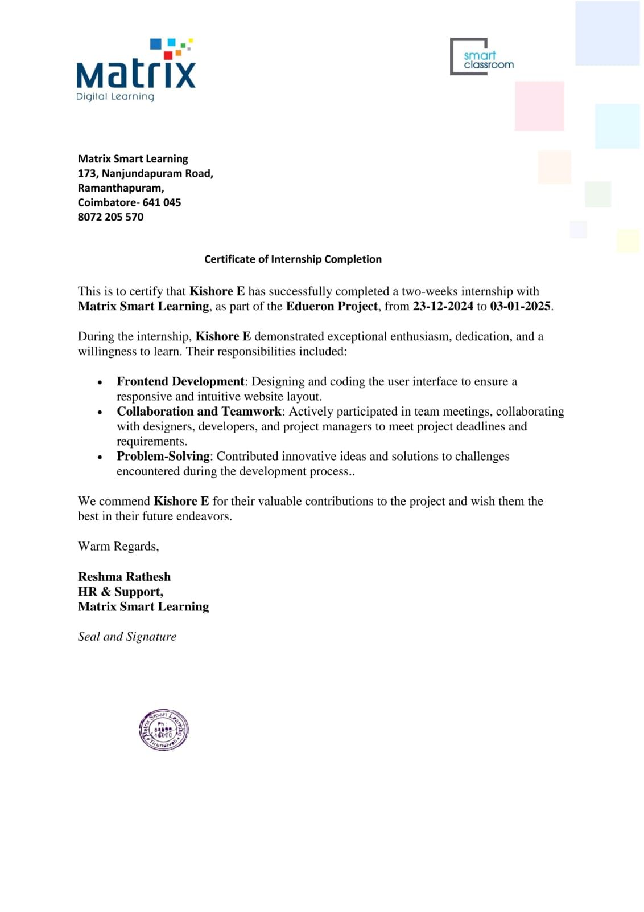

# 🚀 NEET Launchpad  

*A project that started as a small internship task, but became a milestone in my growth as a developer.*  

---

## 🌱 The Journey  

Every big journey begins with a small step. For me, that step was my **two-week internship at Matrix Smart Learning** under the *Edueron Project* (23-12-2024 to 03-01-2025).  

When I first stepped into the internship, I wasn’t just given code to write. I was given **responsibility** — to design something real, something that would **impact students preparing for NEET exams**.  

That’s when the idea of **NEET Launchpad** was born.  

I still remember the challenge:  
- How can I make the interface simple enough for every student?  
- How can I design something fast, responsive, and reliable?  
- How do I ensure it works across devices for students in different situations?  

With guidance and a lot of trial and error, I built **NEET Launchpad**, a responsive and engaging landing page for NEET aspirants.  

It wasn’t just code on a screen—it was my **first real contribution** to an educational platform.  

---

## 📖 Why It Matters  

This project may look like “just a landing page,” but for me, it was:  
- 🎯 **My first step into professional frontend development**  
- 🤝 A chance to **collaborate with a team** and learn how real projects move forward  
- 🧩 A reminder that even small tasks can **impact real users**  
- 💡 The spark that gave me confidence to pursue bigger goals in tech  

And the best part? My effort was recognized with an official **certificate of completion** from Matrix Smart Learning.  

📜 **Certificate of Internship Completion**:  


This certificate isn’t just paper — it’s proof of my **first milestone in tech**.  

---

## 📌 Overview of NEET Launchpad  

NEET Launchpad is a clean and responsive landing page that provides an engaging and informative experience for students preparing for NEET exams.  

The design focuses on:  
- Student engagement  
- Accessibility  
- Smooth navigation  
- Mobile-first responsive design  

---

## ✨ Features  

- 🎨 **Modern UI/UX** – clean, minimal, and visually appealing  
- 📱 **Responsive Design** – works seamlessly on desktop, tablet, and mobile  
- ⚡ **Fast Performance** – optimized assets and clean structure  
- 📂 **Multiple Sections** – About, Features, Contact, FAQ, etc.  
- 🔗 **Easy Navigation** with smooth scrolling  
- 🧩 **Reusable Components** for scalability  

---

## 🛠 Tech Stack  

<p align="left">
  
  
  
</p>  

[](https://kishore3002.github.io/neet-launchpad/)  

---

## 📸 Screenshots  

**Home Section**  
  

**Features Section**  
  

**About Section**  
  

---

## ⚙️ Setup & Installation
Step 1 : Clone the repository  
Open terminal in VS Code (`Ctrl + Shift + ~`) and run:
```bash
git clone https://github.com/kishore3002/neet-launchpad.git
```

step 2 : Open the project folder 
```bash
cd neet-launchpad
```

step 3: Run in browser
Just open index.html in your preferred browser(chrome)

----
## 🌟 Skills Gained  

- 🖌️ **Frontend Development** (HTML5, CSS3, JS)  
- 📱 **Responsive Web Design**  
- 🔄 **Team Collaboration & Communication**  
- ⏳ **Time Management under deadlines**  
- 🧠 **Problem-Solving mindset**  

---

## 📬 Contact  

- 👤 **Kishore E**  
- 🐙 **GitHub:** [@kishore3002](https://github.com/kishore3002)  
- 💼 **LinkedIn:** [linkedin.com/in/kishore-offic](https://www.linkedin.com/in/kishore-offic)  
- 📧 **Email:** [ekishore134@gmail.com](mailto:ekishore134@gmail.com)  


## 📝 License
This project is licensed under the MIT License – free to use and modify with attribution.
